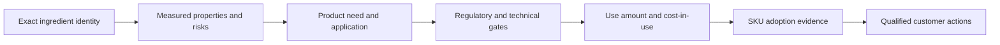

# Ingredient Opportunity Research

An evidence-led Codex skill for turning ingredient science into downstream application hypotheses, regulatory gates, formulation economics, and auditable B2B customer discovery.

中文简介：这是一个面向消费品原料销售团队的研究工作流。它不会替行业专家替市场机会打分，而是把“原料特性 → 产品需求 → 应用硬门槛 → 产品采用 → 客户行动”整理成可复核的证据链。

## Why this project exists

Generic market research often starts with attractive categories and works backward to justify an ingredient. That creates predictable errors: confusing similarly named materials, transferring one jurisdiction's approval to another, treating a patent as commercial adoption, using public listing prices as transaction prices, or recommending a formulation before checking failure modes.

This project reverses that sequence:



## What the skill does

- distinguishes material identity, grade, source, molecule, strain, and jurisdiction;
- traces each proposed application to measured properties or labels it as a hypothesis;
- audits China, the United States, and the European Union in one category-specific table for food ingredients;
- validates formulation, process, storage, sensory, safety, and failure modes using original literature where possible;
- separates public price signals, formal quotations, shipment estimates, and transactions;
- calculates ingredient-system and finished-product ingredient-cost changes without calling them total manufacturing cost;
- verifies current use at SKU level and keeps adoption status separate from buyer fit;
- produces a Markdown feasibility report first, then optional customer lists, interview guides, KA cards, or presentation outlines.

## Repository structure

```text
.
├── skill/ingredient-opportunity-research/  # installable Codex skill
├── examples/                               # three ingredient research cases
├── evaluation/case-audit.md                # hard-gate and rubric review
├── prompts/example-prompts.md              # reproducible usage prompts
├── scripts/validate_project.py             # dependency-free structure check
└── .github/workflows/validate.yml           # CI validation
```

## Case studies

| Case | Research problem | What it demonstrates | Current evidence status |
|---|---|---|---|
| [Isomalt in China bakery](examples/01-isomalt-china-bakery.md) | Application feasibility + 10 potential customers | identity disambiguation, human tolerability, use-cost model, claim boundary | 82/100 screening input; public SKU coverage disclosed, complete labels and US route remain incomplete |
| [Gellan gum in consumer products](examples/02-gellan-gum-consumer-products.md) | Broad application scan + first-account selection | grade-specific functionality, exact core beverage regulation, alternatives/co-formulation, conditional account priority | 72/100 project-screening example; current labels, EU SKU classification and matched system cost remain incomplete |
| [HMO global market](examples/03-hmo-global-market.md) | Molecular-family opportunity + 10 accounts | China six-molecule status/use matrix, education burden, conditional customer routing | 68/100 project-screening example; supplier strains, full US/EU matrix, current labels and industrial RFQs remain incomplete |

The examples intentionally retain unresolved evidence. They demonstrate how the workflow narrows conclusions when commercial, regulatory, or SKU-level evidence is unavailable. See the [case audit](evaluation/case-audit.md) before using any example as a decision input.

## Install and invoke

Copy `skill/ingredient-opportunity-research` into your Codex skills directory, then invoke:

```text
Use $ingredient-opportunity-research to research [ingredient] in [market/application].
Produce the Markdown feasibility report first, then identify [N] potential customers.
```

For Chinese usage:

```text
使用 $ingredient-opportunity-research，调研[原料]在[国家/产品领域]的市场机会，
并找出[N]个潜在客户。先输出Markdown可行性分析报告。
```

More prompts are in [prompts/example-prompts.md](prompts/example-prompts.md).

## Quality model

Reports are evaluated in two stages:

1. **Hard gates:** identity, core regulation, property traceability, adoption evidence, claim/efficacy separation, adverse-effect search, and language accuracy.
2. **Research-quality rubric:** a 100-point output-quality assessment covering science, regulation, formulation, price, adoption, customer discovery, and executable validation.

The score measures report quality, never the attractiveness of an ingredient opportunity. An unresolved decision-readiness blocker remains visible even if the narrative is commercially appealing.

## Validate locally

```bash
python3 scripts/validate_project.py
```

The check verifies required files, skill frontmatter, local Markdown links, reference targets, and the three example reports.

## Boundaries

- Public sources do not reveal confidential formulations, supplier relationships, contract prices, or customer intent.
- Regulatory plausibility is not legal advice or approval.
- A product label verifies presence, not use amount or causal performance.
- Patents and supplier application notes are test starting points, not validated production recipes.
- The consumer-product workflow only partially transfers to industrial-only materials.

## Project maturity

The skill itself is reusable; the three cases are evidence snapshots dated 2026-07-17. Time-sensitive regulation, price, product availability, and company signals must be refreshed before commercial use.
