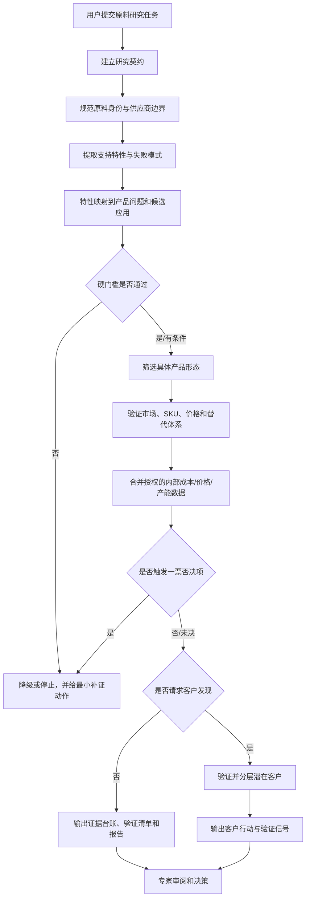

# 原料机会调研系统 PRD

| 字段 | 内容 |
|---|---|
| 产品名称 | Ingredient Opportunity Research／原料机会调研系统 |
| 文档版本 | v1.1 |
| 文档状态 | 根据用户反馈修订 |
| 更新时间 | 2026-08-19 |
| 产品形态 | 可安装的 AI Agent Skill；输出 Markdown 决策报告 |
| 首要用户 | 化工企业战略发展部的战略/市场研究人员 |
| 次要用户 | 未设完整战略部门的企业主、业务负责人或兼职市场研究人员 |
| 协作角色 | 工艺研发、应用研发、销售、法规、财务与行业专家 |
| 当前产品阶段 | v1 初步开发完成；进入跨原料持续验证与维护阶段 |

## 1. 产品摘要

合成生物学和其他生产技术的进步，使越来越多过去无法规模化的新原料成为可开发对象。但一种新化工原料从工艺研发、放大验证到产线建设，往往需要长期技术投入和重资产投入；如果投产后缺乏真实需求，企业可能承担显著的沉没成本、闲置产能和经营亏损。因此，在研发立项或资本投入前完成详尽的原料机会调研，是许多化工企业战略发展部门的重要工作。

过去这类调研通常需要战略、市场、工艺、法规、应用、销售和财务等多领域人员共同收集与判断资料。AI 可以显著扩大检索覆盖面并复用专家方法，但论文、专利、法规、供应商材料、市场报告、商品标签和客户线索的对象、口径与证据等级并不一致。若缺少约束，通用 AI 也可能把它们压缩成一个流畅却不可审计的“市场机会”。

本产品不是替用户判断“这个市场值不值得做”，而是把原料机会研究转化为一条可追溯的决策链：

`原料身份 → 支持特性 → 产品问题 → 硬门槛 → 具体产品形态 → 市场采用 → 客户行动 → 停止条件`

系统的首要价值是节省跨领域搜索时间、提高机会调研的专业覆盖度，并暴露不能继续推断的证据缺口。最核心的交付不是一篇长报告，而是**证据台账**和**可执行验证清单**；用户据此继续核验、补充内部数据并做最终判断。

## 2. 背景与问题

### 2.1 用户现状

战略发展人员需要在信息不完整时决定：

- 是否继续研究某个原料或应用；
- 优先验证哪一种成品形态；
- 是否投入工艺研发、放大试验、产线建设、配方实验、法规确认、RFQ 或客户拜访；
- 哪些客户值得进入销售漏斗；
- 何时停止，避免继续投入无效研究和开发资源。

现有替代方案主要是跨部门专家协作、人工搜索、通用聊天模型、采购市场报告或咨询项目。人工流程专业但耗时、视角受参与人员限制；通用模型可以增加信息量，但未必稳定保留原料身份、法规条件、证据边界和停止条件。

### 2.2 核心问题

> 当新原料研发和产能建设需要高额、不可逆投入时，化工企业战略人员需要在公开信息碎片化、专业跨度大且内部经营数据不完整的情况下，快速识别机会和一票否决项；现有方法难以同时兼顾检索效率、专业覆盖度、证据可审计性和跨案例复用。

### 2.3 已观察到的问题模式

以下问题来自现有案例审计和用户反馈，是本系统需要持续回归检查的高风险模式：

1. **对象混淆：** 同名原料、不同纯度、菌株、来源、生产路线或牌号被当成同一个产品；
2. **证据越级：** 机制、动物实验、专利示例或法规许可被写成成品人体功效；
3. **市场错配：** 产能、产量、库存、销量、推荐摄入差和非约束询盘被混成供需缺口；
4. **采用幻觉：** 公司属于某个品类被写成正在使用或准备采购目标原料；
5. **价格失真：** 不同规格、数量、时间和贸易条件的价格被直接比较；
6. **行动断层：** 报告给出宏观建议，却没有验证对象、动作、证据门槛和停止条件。

### 2.4 一票否决项

原料机会不是各维度平均分较高就可以推进。一个看似很小的信息也可能改变数亿元级投入的合理性。系统必须把以下项目作为独立 veto gate，而不是让其他优点抵消：

- 可服务市场容量低于企业自定义的最低投资门槛；
- 预计法规准入时间超过项目可接受窗口，或合法路径不成立；
- 公司工艺路线下的可实现生产成本高于可成交价格，且无可验证溢价；
- 可销售产能、真实需求或客户验证无法支持拟议装置规模；
- 原料身份、菌株/来源、规格或专利/授权条件与目标产品不匹配；
- 关键安全、技术或放大风险没有可接受的验证路径。

具体阈值必须由企业结合项目回报要求、资金成本和战略目标配置，系统不得虚构通用行业门槛。

## 3. 产品目标与非目标

### 3.1 产品目标

已完成的 v1 需要做到：

1. 将候选应用追溯到明确的原料身份、支持特性和产品问题；
2. 在商业推荐前执行法规、技术、用量、成本和买家可见性硬门槛；
3. 对市场、价格、产能、SKU 采用和客户线索保留可复查的证据台账；
4. 将决策关键未知转化为带负责人、证据门槛和停止条件的可执行验证清单；
5. 让用户可以看懂结论如何形成，以及什么新证据会改变结论；
6. 为不同 Agent 和研究员提供一致的输出契约与质量检查方式。

### 3.2 非目标

v1 不负责：

- 自动替代业务、法规、研发或采购负责人做最终决定；
- 输出一个综合“机会分”掩盖不同风险；
- 根据公开资料推断保密配方、供应商关系、合同价格或采购意向；
- 自动购买付费数据、绕过访问控制或使用未授权内部资料；
- 直接生成可投产配方、法律意见或财务投资建议；
- 承诺提高销售转化、立项成功率或投资回报；
- 建设完整 Web 协作平台、数据库和自动监控系统；
- 将未经脱敏和授权的内部工艺、成本、报价或产能数据发送给外部模型。

## 4. 用户与核心任务

### 4.1 首要用户

**化工企业战略发展部的战略/市场研究人员**：负责在新原料工艺开发、产能建设或市场进入前组织跨专业机会调研，为管理层提供证据、风险和下一步验证建议。

### 4.2 次要用户

部分化工企业没有完整战略部门或专职市场研究员，企业主、业务负责人或销售负责人会兼职完成机会研究。他们熟悉自身业务，但未必同时具备工艺、法规、市场、应用和财务视角，需要系统提供一个跨专业的基础框架。

### 4.3 协作角色

| 角色 | 主要任务 | 系统提供的价值 | 保留的人类责任 |
|---|---|---|---|
| 战略/市场研究 | 组织机会调研与投资前判断 | 跨专业框架、证据台账、验证清单 | 综合判断与管理层沟通 |
| 工艺研发 | 评估路线、放大、投资和成本 | 待补内部变量、外部基准和敏感性 | 工艺数据、可实现成本和放大结论 |
| 销售 | 选择应用和客户切入点 | 账户证据、采用状态、谈话假设 | 客户关系、商机真实性、成交判断 |
| 应用研发 | 设计最小实验 | 矩阵/工艺约束、起始量依据、失败指标 | 配方设计、实验执行和技术签字 |
| 市场/战略 | 评估需求与竞争 | 市场口径、替代体系、教育负担 | 战略优先级和资源配置 |
| 法规 | 确认合法路径与宣称边界 | 分市场法规证据和未决项 | 正式法规意见与合规审批 |
| 行业专家 | 审阅关键结论 | 可追溯证据链和 blocker 清单 | 领域判断与最终决策 |

| 财务/管理层 | 判断资本投入和回报风险 | 市场、成本、产能和情景边界 | 资金成本、投资门槛和最终立项 |

### 4.4 Jobs to be done

当一项新技术使某种原料具备开发可能时，我希望系统帮我快速完成跨领域资料搜索，识别会否决研发或重资产投入的关键信息，沉淀可追溯的证据台账和验证清单，并指出需要用公司内部数据继续核算的地方，从而更专业、更高效地支持立项、停止或补证决定。

## 5. 使用场景与范围

### 5.1 v1 支持范围

- 原料类型：用于消费品的食品饮料、营养、个护美妆、家清和宠物相关原料；
- 地区：用户指定；食品原料默认比较中国、美国和欧盟；
- 输入：原料名称/规格、目标地区、业务目标、供应商能力与约束、授权数据源，以及用户选择提供的内部经营数据；
- 核心交付：证据台账、可执行验证清单和 Markdown 市场可行性报告；
- 可选后续交付：潜在客户清单、KA 进攻卡、访谈提纲、演示结构；
- 前置约束：客户发现和销售交付必须建立在已有可行性分析之上。

### 5.2 暂不支持

- 纯工业中间体的完整行业研究；
- 实时自动监测和数据库持续更新；
- 未经授权的付费数据库、私有报价和客户信息；
- 多人在线编辑、权限、审批和审计后台；
- 自动 CRM 写入或外部联系客户。

### 5.3 决定性内部数据

公开研究用于建立外部事实和待核验边界，但以下内部数据经常会改变最终结论：

- 工艺开发、放大验证和装置建设投入；
- 按企业实际路线、收率、良率、利用率和折旧口径核算的生产成本；
- 企业能够取得的真实成交价、正式 RFQ 或可执行报价，而非公开挂牌价；
- 已建、在建和拟建产能中的合格可销售产能，以及未公开的竞争产能；
- 企业现有设备、菌种/路线、法规档案、客户关系和共线平台可复用程度。

系统应提供结构化字段、敏感性计算口径和缺口提示，但数据所有者决定是否提供。涉及商业秘密时，优先在企业授权环境中处理，不把明文内部数据写入公开案例或仓库。

## 6. 产品原则

1. **先阻止错误推进，再追求报告完整。** 身份、法规或关键技术门槛未闭环时必须降级结论；
2. **事实、估算、假设和未知分开。** 不允许用语气掩盖证据状态；
3. **一票否决项不被平均分抵消。** 市场容量、法规周期、成本经济性、产能和安全等 veto gate 分开表达，不提供掩盖风险的综合机会分；
4. **产品形态先于市场规模。** 应用必须落到基质、工艺、用量、包装、宣称和买家；
5. **最小补证优先。** 每个关键未知都应对应能改变决定的最小动作；
6. **负面结论也是有效交付。** 数据不可比时允许输出 `not reliably estimable`；
7. **核心交付先于长报告。** 先形成证据台账与验证清单，再生成叙述性报告；
8. **人类保留决策权。** AI 负责检索、结构化、审计和建议验证，不负责最终商业签字。

## 7. 端到端用户流程

### 7.1 标准状态

每个候选应用只能进入以下一种状态：

- `advance`；
- `conditional—experiment required`；
- `regulatory unresolved`；
- `technical evidence insufficient`；
- `do not advance`。

状态必须同时显示决定性证据、失败门槛、未知项和下一步动作，不能只给标签。

## 8. 功能需求

优先级采用 `P0 / P1 / P2`：P0 为 MVP 不可缺失，P1 为完成核心闭环的重要能力，P2 为验证采用后再建设。

### 8.1 研究契约与输入检查

| ID | 优先级 | 需求 | 验收标准 |
|---|---|---|---|
| FR-01 | P0 | 捕获原料身份、规格、来源、目标地区、业务目标、拟议投入和供应商约束 | 缺失项被明确标为假设或未知；只询问会改变研究范围或 veto gate 的问题 |
| FR-02 | P0 | 根据请求路由到可行性、客户发现、KA 或销售材料模式 | 没有现成可行性分析时，不直接生成客户进攻或销售材料 |
| FR-03 | P1 | 记录时间窗、语言、可使用数据源和研究深度 | 报告开头可复查研究范围和截止日期 |

### 8.2 身份和证据管理

| ID | 优先级 | 需求 | 验收标准 |
|---|---|---|---|
| FR-04 | P0 | 规范原料名称、同义词、级别、纯度、物态、生产路线、菌株/来源 | 关键证据不能从相似但不等同对象直接迁移 |
| FR-05 | P0 | 为关键事实保留来源、日期、定位、阅读深度、利益关系和限制 | 原料特性表每一行都有行内来源和证据边界 |
| FR-06 | P0 | 区分原始来源、二手转述和同源重复数字 | 同一最早来源的多个数字不能被当成独立佐证 |
| FR-07 | P1 | 将事实、估算、假设和未知分层呈现 | 用户可以在报告中直接识别四种状态 |

### 8.3 应用筛选与硬门槛

| ID | 优先级 | 需求 | 验收标准 |
|---|---|---|---|
| FR-08 | P0 | 执行 `特性 → 产品问题 → 所需功能 → 应用` 映射 | 每个优先应用可追溯到支持特性；否则标为假设 |
| FR-09 | P0 | 分别检查市场容量、法规周期、技术、安全、使用量、成本经济性、产能和买家可见性 | 任一 veto gate 触发时输出停止；未解决时不得输出无条件推进 |
| FR-10 | P0 | 食品原料默认分别审计中国、美国和欧盟 | 每个市场给出 `pass/conditional/fail/unresolved`、条件与来源 |
| FR-11 | P0 | 将应用拆成可销售产品形态 | 每个形态包含基质/相态、工艺、接触方式、包装、用量、宣称、替代品和买家 |
| FR-12 | P1 | 对技术建议标明直接证据或类比迁移 | 未验证配方只能作为实验起点，不得写成生产配方 |

### 8.4 市场、价格与采用验证

| ID | 优先级 | 需求 | 验收标准 |
|---|---|---|---|
| FR-13 | P0 | 分开名义产能、合格可销售产能、产量、出货、销量、库存、需求量和市场价值 | 报告不得把不同指标直接替换或相减；未公开产能标为未知 |
| FR-14 | P0 | 对供需机会分别表达需求成熟度、供应约束和证据状态 | 口径不能对齐时输出 `not reliably estimable` |
| FR-15 | P0 | 对价格执行同口径检查 | 明确活性规格、数量、日期、币种、税费、Incoterms、付款条件和供应商类型的错配 |
| FR-16 | P0 | 对当前采用要求 SKU 级标签或等效记录 | 品类相关公司不能被标为 current user |
| FR-17 | P1 | 区分技术、人群使用/不良反应、法规宣称、消费者和商业效果 | 销量、评论或合法宣称不能被用于证明原料因果功效 |
| FR-18 | P1 | 比较替代体系、共配和保留原体系 | 对比基于功能等价、使用量、工艺和成本口径，而非公斤单价 |

### 8.5 企业内部数据与投资前判断

| ID | 优先级 | 需求 | 验收标准 |
|---|---|---|---|
| FR-19 | P0 | 提供工艺投入、资本开支、收率、良率、利用率、生产成本、成交价和可销售产能字段 | 未提供时显示为关键未知，不使用行业平均值冒充公司数据 |
| FR-20 | P0 | 将内部数据与公开市场证据进行情景和敏感性核算 | 已知数、企业假设、外部估算和计算结果分开；公式与单位可复查 |
| FR-21 | P0 | 根据企业配置阈值执行一票否决检查 | 明确触发字段、阈值来源、当前证据、结论和改变结论所需数据 |

### 8.6 客户发现与行动转化

| ID | 优先级 | 需求 | 验收标准 |
|---|---|---|---|
| FR-22 | P1 | 基于具体产品形态定义 ICP | ICP 包含技术、法规、供应商匹配、规模和可接近信号 |
| FR-23 | P1 | 将账户分为 verified current user、plausible buyer 和 exploratory lead | 每个账户有独立的账户证据；不得虚构采购或决策权 |
| FR-24 | P1 | 输出能改变决定的下一步动作 | 动作包含对象、执行方式、所需证据、通过信号和停止条件 |
| FR-25 | P2 | 生成 KA 卡、访谈提纲和演示结构 | 只引用已完成可行性报告中的证据，不引入新事实 |

### 8.7 输出与质量检查

| ID | 优先级 | 需求 | 验收标准 |
|---|---|---|---|
| FR-26 | P0 | 输出结构化证据台账 | 每条关键 claim 包含对象、证据、来源、日期、口径、等级、限制、反证和待核验状态 |
| FR-27 | P0 | 输出可执行验证清单 | 每项包含决策问题、动作、负责人、所需数据、通过/失败信号和停止条件 |
| FR-28 | P0 | 基于台账和清单生成 Markdown 可行性报告 | 结论置顶；关键判断能回链到台账，不新增无来源事实 |
| FR-29 | P0 | 执行规则型完整性检查 | blocker 未解决时不得称为 decision-ready |
| FR-30 | P0 | 保留研究边界和刷新提示 | 法规、价格、产能、SKU 和公司状态标明观察日期并提示商业使用前刷新 |
| FR-31 | P1 | 支持中文、英文和双语交付 | 不因翻译改变身份、法规术语或结论强度 |

## 9. AI Agent 设计

### 9.1 Agent 职责

AI Agent 负责：

- 解析任务并建立研究契约；
- 按需加载法规、技术、价格、市场、产品形态、客户和质量规则；
- 使用公开或用户授权的数据源检索和结构化证据；
- 检查对象、口径、来源独立性和证据迁移风险；
- 将用户授权的工艺投入、生产成本、真实价格和产能数据与公开证据分层合并；
- 先生成证据台账和验证清单，再生成带来源、未知项和停止条件的报告；
- 在规则不满足时降级结论或请求人工确认。

### 9.2 人工确认点

以下节点必须保留人类责任，不允许 Agent 自动越权：

1. 精确原料/牌号、工艺投入、生产成本、真实成交价和可销售产能确认；
2. 法规路径和允许宣称的正式确认；
3. 配方、实验方案、人体/动物安全和生产放大审批；
4. RFQ、客户联系、报价和合同承诺；
5. 立项、扩产、投资和停止决定。

### 9.3 降级策略

| 失败情形 | 系统行为 |
|---|---|
| 关键身份不明确 | 暂停跨来源证据拼接，输出需要确认的规格字段 |
| 付费或受限来源不可访问 | 使用公开来源替代并降低证据等级 |
| 无法取得完整 SKU 标签 | 标为 `no public evidence found`，不得写 `confirmed absent` |
| 市场数字无法同口径化 | 输出区间或 `not reliably estimable` |
| 法规或技术 blocker 未闭环 | 输出有条件/停止状态，不给无条件商业推荐 |
| 来源冲突 | 并列冲突、解释口径差异并提出最小核验动作 |

## 10. 非功能需求

| 类别 | 要求 |
|---|---|
| 可审计性 | 每个重大结论都能定位到来源、计算、假设和限制 |
| 可复现性 | 相同冻结输入和版本下能执行相同工作流与质量检查 |
| 安全与隐私 | 不记录密钥；不暴露非必要个人信息、私有价格或客户机密 |
| 企业数据隔离 | 公开研究与内部经营数据分层；内部数据默认不进入公开仓库或案例 |
| 可维护性 | 主 Skill 负责路由，复杂规则拆到独立 references；避免重复真源 |
| 可移植性 | 核心为 Markdown 规则与模板，不依赖单一模型厂商专有语法 |
| 时效性 | 对法规、价格、SKU 和公司事实记录观察日期，使用前要求刷新 |
| 可解释性 | 结论必须呈现形成路径、适用条件、反证和改变结论所需证据 |

## 11. 成功指标

### 11.1 北极星指标

**专家认可的决策关键 blocker 召回率**：在冻结案例中，系统识别出的法规、技术、身份、市场和采用 blocker，占专家共识 blocker 的比例。

选择该指标的原因：在重资产决策中，漏掉一个具有一票否决权的信息，可能比搜索时间节省带来的全部收益更大。效率指标必须建立在不降低 blocker 召回和事实准确性的前提下。

### 11.2 下一轮验证指标

| 指标 | 预注册门槛 | 测量方法 |
|---|---:|---|
| Skill 独有关键硬门槛漏检 | 0 | 5 个真实冻结案例，与无 Skill 基线比较 |
| 严重无证据强结论 | 0 | 3 名盲评者按预注册 rubric 判断 |
| 决策 blocker 召回率 | ≥90% | 对比行业专家共识清单 |
| 下一步可执行性 | ≥4/5 案例通过 | 是否包含对象、动作、证据门槛和停止条件 |
| 搜索与研究准备时间 | 在至少 3 个真实案例中复现中位数降低 ≥80% | 同输入、同交付范围记录人工基线和 Skill 用时 |
| 专家实质修改量 | 中位数降低 ≥15% | 统计结论、证据边界和行动项的人工改动 |
| 市场现实匹配度 | 不低于专家基线 | 事后用真实价格、产能、客户反馈和法规进展复核 |
| 建议准确性 | 严重错误为 0 | 专家判断建议是否由证据支持、是否遗漏 veto gate |

### 11.3 护栏指标

- 引用存在但不支持结论的比例；
- 身份或法规跨对象迁移次数；
- 被错误标记为 current user 的账户数；
- 不同口径价格或市场数字被直接计算的次数；
- 需要人工升级但系统未提示的次数。

### 11.4 当前证据与边界

当前存在三类证据：

1. **工程与案例证据：** 结构校验、案例审计和回归检查已完成；
2. **三案例合成对照证据：** 在预注册的扩产供需、宠物食品跨菌株/物种迁移和护肤专线经济性案例中，Direct 组总分为 283/300，Skill 组为 298/300，描述性平均差为 +5.0 分；两组均无硬失败，三次 headline decision 相同。该结果支持审计完整性和行动可执行性改善，不支持真实市场准确率或一般模型优势；
3. **用户提供的初步专家试用反馈：** 专家认为系统有效、覆盖较全面，试用中未发现明显错误；相较原有人工搜索，估计节省约 80%–90% 时间，并因扩大信息覆盖而帮助提高判断准确性。

第三类反馈支持产品已经进入可用和持续验证阶段，但当前仓库尚未保存试用专家数量、原料清单、任务范围、人工基线用时、Skill 用时、错误定义和逐项评审记录。因此，80%–90% 和“提高准确性”应作为**用户报告的初步结果**，不能暂时写成已完成的独立量化验证。三案例合成评分也不能替代这些真实工作流证据。

## 12. 评测与验收方案

### 12.1 上线前验证层级

1. **结构验证：** frontmatter、必需文件、相对链接、输出章节和案例契约；
2. **行为回归：** 对抗用例检查身份混淆、法规迁移、客户幻觉、价格错配和虚假供需缺口；
3. **案例评测：** 覆盖食品、营养、个护和新型/受保护原料；
4. **盲评对照：** 同一输入、工具、时限和模型族，对比无 Skill 与 Skill；
5. **真实工作流测试：** 行业专家记录 blocker、修改量、时间和最终行动变化。

### 12.2 持续验证和强结论门槛

v1 已完成初步开发并有专家试用反馈。若要在公开材料中把“节省 80%–90% 时间”和“提高准确性”升级为经过验证的产品结论，需要满足：

- P0 功能需求全部有对应规则、模板或测试用例；
- 项目验证脚本和官方 Skill 校验通过；
- 关键引用、相对链接和隐私扫描通过；
- 至少 5 个不同原料的冻结案例中不存在 Skill 独有硬失败；
- 3 名盲评者确认严重无证据强结论为 0；
- 所有报告明确事实、估算、假设、未知和人工确认点；
- 每个计时案例保存相同任务范围的人工基线、Skill 用时和专家修改时间；
- README 和 PRD 不把内部评分、个人估计或试用反馈写成独立验证的商业效果。

### 12.3 停止或回退条件

- 任一真实案例出现 Skill 独有的身份、法规或客户采用硬失败；
- 为提高评分而增加的规则导致其他案例上下文冲突或错误降级；
- 无法达到至少 4/5 案例的行动可执行性；
- 新规则没有关闭明确的 evidence、coverage 或 decision gap；
- 用户需要的是工业供应链研究，而当前消费品工作流无法合理适配。

## 13. 版本规划

### v1.0：Skill MVP（已完成）

- 研究契约、特性到市场链路和硬门槛；
- 产品形态、市场需求、价格、技术和采用审计；
- 证据台账、验证清单、Markdown 可行性报告与可选客户行动；
- 结构验证、案例审计、回归测试和迭代记录。

### v1.x：跨原料持续验证与维护（当前）

- 用不同原料持续比较系统判断与实际价格、产能、法规和客户情况；
- 建立 5 个以上冻结真实案例和专家 gold set；
- 多评审盲评、完成时间和修改量记录；
- 根据失败类型做最小规则修复；
- 明确哪些模块应默认加载，哪些应按条件加载。

### v2：可组合战略分析工具

- 保持 Skill 形态，可接入公司级战略分析、决策 Agent 或其他平台；
- 提供结构化输入输出契约、企业数据接口和版本化证据对象；
- 与其他财务、技术、竞争和项目决策 Skill 组合，而不重复建设其能力。

### v3：机会判断写作工作台（按需求建设）

- 结构化 intake、证据台账、验证清单和报告版本比较；
- 专家批注、人工确认点和决策日志；
- 数据刷新提醒和可选 CRM/知识库接口；
- 权限、敏感数据分级和组织级审计。

v2 和 v3 不是当前已实现能力。平台化的前提不是继续增加规则，而是确认企业需要长期复用、协作、权限和数据集成；否则 Skill 作为可组合工具已经是更轻量的产品形态。

## 14. 依赖、风险与应对

| 风险 | 影响 | 当前应对 |
|---|---|---|
| 公开资料覆盖不足 | 无法形成可靠市场或采用判断 | 降级结论，给出 RFQ、标签或专家核验动作 |
| 企业内部成本、成交价或产能缺失 | 外部机会无法转化为公司级投资判断 | 明确列为 veto 未决项，提供字段和敏感性，不用公开均值替代 |
| 模型生成流畅但错误的引用解释 | 形成虚假确定性 | 逐结论来源、定位、阅读深度和反证检查 |
| 规则过多导致上下文和执行成本上升 | 输出变慢或忽略关键要求 | 渐进加载 references，只保留关闭明确风险的规则 |
| 过度保守导致所有结论都无法推进 | 用户认为没有行动价值 | 强制输出最小补证动作、通过信号和停止条件 |
| 内部量表被误认为机会评分 | 错误比较原料优先级 | 将研究质量和机会判断明确分离 |
| 时间敏感事实过期 | 商业决策基于旧法规、价格或 SKU | 保存观察日期，商业使用前刷新 |
| 用户把系统当作法规/研发替代 | 合规或安全风险 | 在报告和关键节点保留人工签字责任 |

## 15. 已确认产品输入与剩余问题

### 15.1 本轮已确认

- 首要用户是化工企业战略发展部人员；没有完整战略部门时，企业主、业务负责人或兼职市场研究人员也是用户；
- 核心风险是新原料工艺研发和重资产投入后缺乏市场需求；
- 用户最希望节省搜索时间，并通过跨专业覆盖提高研究质量；
- 最能改变结论的内部数据是工艺开发与建设投入、公司实际生产成本、真实成交价格和确定产能；
- 核心交付是证据台账和可执行验证清单，报告是基于两者形成的表达层；
- v1 初步开发已经结束，后续以不同原料做持续准确性、现实匹配和回归测试；
- 长期定位是可接入其他战略分析或决策平台的 Skill，并可按需求延伸为机会判断写作工作台。

### 15.2 仍待验证

1. 专家试用覆盖多少人、多少原料和哪些具体任务？
2. 80%–90% 时间节省的人工基线、计时范围和复现性如何？
3. “没有明显错误”和“提高准确性”的评分标准、反例和专家一致性如何定义？
4. 不同行业和企业应如何配置市场容量、法规周期、回报率和产能利用率 veto 阈值？
5. 什么情况下内部数据可以在企业授权环境中安全接入 Agent？
6. 何种使用频率和协作需求足以支持建设独立写作平台？

## 16. 产品结论

原料机会调研系统 v1 已完成初步开发，并获得专家试用中的正向反馈。它当前最合适的产品形态是一个可组合的证据型决策 Skill：在新原料工艺研发和重资产投入前，帮助战略人员扩大跨专业检索覆盖、识别一票否决项、沉淀证据台账并形成可执行验证清单。

后续工作不是重新开发产品，而是持续用不同原料测试：信息是否准确、结论是否与真实市场匹配、是否遗漏决定性风险、报告建议是否能经受专家和后续事实验证。系统可以继续作为 Skill 接入公司级战略分析或决策平台；只有出现明确的长期协作和写作需求时，再延伸为独立的机会判断工作台。
