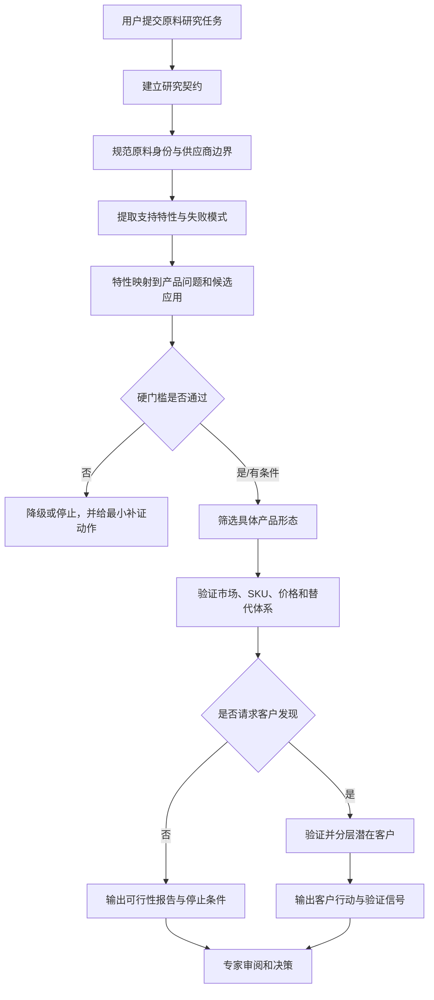

# 原料机会调研系统 PRD

| 字段 | 内容 |
|---|---|
| 产品名称 | Ingredient Opportunity Research／原料机会调研系统 |
| 文档版本 | v1.0 |
| 文档状态 | Draft |
| 更新时间 | 2026-08-19 |
| 产品形态 | 可安装的 AI Agent Skill；输出 Markdown 决策报告 |
| 首要用户假设 | 需要决定是否继续投入的原料业务负责人 |
| 协作角色 | 销售、应用研发、市场/战略、法规与行业专家 |
| 当前验证阶段 | 结构校验、案例审计与单个合成对照已完成；真实用户价值尚待验证 |

## 1. 产品摘要

原料团队面对一种新原料时，通常能找到论文、专利、法规、供应商材料、市场报告、商品标签和客户线索，但这些材料的对象、口径和证据等级并不一致。通用 AI 容易把它们压缩成一个流畅却不可审计的“市场机会”，使团队过早投入应用实验、客户开发或产能建设。

本产品不是替用户判断“这个市场值不值得做”，而是把原料机会研究转化为一条可追溯的决策链：

`原料身份 → 支持特性 → 产品问题 → 硬门槛 → 具体产品形态 → 市场采用 → 客户行动 → 停止条件`

系统的首要价值是暴露不能继续推断的证据缺口，并把缺口转化为最小验证动作。完整报告是交付形式，降低错误推进风险才是产品目标。

## 2. 背景与问题

### 2.1 用户现状

原料业务负责人需要在信息不完整时决定：

- 是否继续研究某个原料或应用；
- 优先验证哪一种成品形态；
- 是否投入配方实验、法规确认、RFQ 或客户拜访；
- 哪些客户值得进入销售漏斗；
- 何时停止，避免继续投入无效研究和开发资源。

现有替代方案主要是人工搜索、通用聊天模型、采购市场报告或咨询项目。它们可以增加信息量，但未必稳定保留原料身份、法规条件、证据边界和停止条件。

### 2.2 核心问题

> 当公开信息碎片化、证据等级混杂且公司内部条件不完整时，原料业务负责人缺少一套可重复、可审计的研究流程，无法清楚区分“已证实”“合理估算”“待验证假设”和“不能继续推断”，从而增加错误商业推进的风险。

### 2.3 已观察到的问题模式

以下问题来自现有案例审计，属于待真实用户研究验证的高风险问题假设：

1. **对象混淆：** 同名原料、不同纯度、菌株、来源、生产路线或牌号被当成同一个产品；
2. **证据越级：** 机制、动物实验、专利示例或法规许可被写成成品人体功效；
3. **市场错配：** 产能、产量、库存、销量、推荐摄入差和非约束询盘被混成供需缺口；
4. **采用幻觉：** 公司属于某个品类被写成正在使用或准备采购目标原料；
5. **价格失真：** 不同规格、数量、时间和贸易条件的价格被直接比较；
6. **行动断层：** 报告给出宏观建议，却没有验证对象、动作、证据门槛和停止条件。

当前没有这些问题的真实发生频率、损失金额或用户采用数据，因此 PRD 不把“降低错误率”表述为已验证结果。

## 3. 产品目标与非目标

### 3.1 产品目标

MVP 需要做到：

1. 将候选应用追溯到明确的原料身份、支持特性和产品问题；
2. 在商业推荐前执行法规、技术、用量、成本和买家可见性硬门槛；
3. 对市场、价格、SKU 采用和客户线索保留可复查的来源与口径；
4. 将决策关键未知转化为最小实验、RFQ、法规确认或标签核验；
5. 让用户可以看懂结论如何形成，以及什么新证据会改变结论；
6. 为不同 Agent 和研究员提供一致的输出契约与质量检查方式。

### 3.2 非目标

MVP 不负责：

- 自动替代业务、法规、研发或采购负责人做最终决定；
- 输出一个综合“机会分”掩盖不同风险；
- 根据公开资料推断保密配方、供应商关系、合同价格或采购意向；
- 自动购买付费数据、绕过访问控制或使用未授权内部资料；
- 直接生成可投产配方、法律意见或财务投资建议；
- 承诺提高销售转化、立项成功率或投资回报；
- 建设完整 Web 协作平台、数据库和自动监控系统。

## 4. 用户与核心任务

### 4.1 首要用户

**原料业务负责人**：拥有继续研究、样品开发、客户验证或停止投入的决策责任，但没有时间逐项审计所有外部资料。

首要用户定位目前是产品假设，需通过真实访谈确认其决策频率、当前流程、最大风险和付费/采用意愿。

### 4.2 协作角色

| 角色 | 主要任务 | 系统提供的价值 | 保留的人类责任 |
|---|---|---|---|
| 销售 | 选择应用和客户切入点 | 账户证据、采用状态、谈话假设 | 客户关系、商机真实性、成交判断 |
| 应用研发 | 设计最小实验 | 矩阵/工艺约束、起始量依据、失败指标 | 配方设计、实验执行和技术签字 |
| 市场/战略 | 评估需求与竞争 | 市场口径、替代体系、教育负担 | 战略优先级和资源配置 |
| 法规 | 确认合法路径与宣称边界 | 分市场法规证据和未决项 | 正式法规意见与合规审批 |
| 行业专家 | 审阅关键结论 | 可追溯证据链和 blocker 清单 | 领域判断与最终决策 |

### 4.3 Jobs to be done

当我收到一个具有零散科学、法规和市场信号的原料时，我希望快速知道哪些产品形态值得继续验证、哪些证据不足以支持商业推进，以及下一笔研究或验证预算应该花在哪里，从而避免因为流畅但错误的研究结论投入错误方向。

## 5. 使用场景与范围

### 5.1 MVP 支持范围

- 原料类型：用于消费品的食品饮料、营养、个护美妆、家清和宠物相关原料；
- 地区：用户指定；食品原料默认比较中国、美国和欧盟；
- 输入：原料名称/规格、目标地区、业务目标、供应商能力与约束、授权数据源；
- 默认交付：Markdown 市场可行性报告；
- 可选后续交付：潜在客户清单、KA 进攻卡、访谈提纲、演示结构；
- 前置约束：客户发现和销售交付必须建立在已有可行性分析之上。

### 5.2 暂不支持

- 纯工业中间体的完整行业研究；
- 实时自动监测和数据库持续更新；
- 未经授权的付费数据库、私有报价和客户信息；
- 多人在线编辑、权限、审批和审计后台；
- 自动 CRM 写入或外部联系客户。

## 6. 产品原则

1. **先阻止错误推进，再追求报告完整。** 身份、法规或关键技术门槛未闭环时必须降级结论；
2. **事实、估算、假设和未知分开。** 不允许用语气掩盖证据状态；
3. **硬门槛不被平均分抵消。** 不提供模型生成的综合机会分；
4. **产品形态先于市场规模。** 应用必须落到基质、工艺、用量、包装、宣称和买家；
5. **最小补证优先。** 每个关键未知都应对应能改变决定的最小动作；
6. **负面结论也是有效交付。** 数据不可比时允许输出 `not reliably estimable`；
7. **人类保留决策权。** AI 负责检索、结构化、审计和建议验证，不负责最终商业签字。

## 7. 端到端用户流程

### 7.1 标准状态

每个候选应用只能进入以下一种状态：

- `advance`；
- `conditional—experiment required`；
- `regulatory unresolved`；
- `technical evidence insufficient`；
- `do not advance`。

状态必须同时显示决定性证据、失败门槛、未知项和下一步动作，不能只给标签。

## 8. 功能需求

优先级采用 `P0 / P1 / P2`：P0 为 MVP 不可缺失，P1 为完成核心闭环的重要能力，P2 为验证采用后再建设。

### 8.1 研究契约与输入检查

| ID | 优先级 | 需求 | 验收标准 |
|---|---|---|---|
| FR-01 | P0 | 捕获原料身份、规格、来源、目标地区、业务目标和供应商约束 | 缺失项被明确标为假设或未知；只询问会改变研究范围的问题 |
| FR-02 | P0 | 根据请求路由到可行性、客户发现、KA 或销售材料模式 | 没有现成可行性分析时，不直接生成客户进攻或销售材料 |
| FR-03 | P1 | 记录时间窗、语言、可使用数据源和研究深度 | 报告开头可复查研究范围和截止日期 |

### 8.2 身份和证据管理

| ID | 优先级 | 需求 | 验收标准 |
|---|---|---|---|
| FR-04 | P0 | 规范原料名称、同义词、级别、纯度、物态、生产路线、菌株/来源 | 关键证据不能从相似但不等同对象直接迁移 |
| FR-05 | P0 | 为关键事实保留来源、日期、定位、阅读深度、利益关系和限制 | 原料特性表每一行都有行内来源和证据边界 |
| FR-06 | P0 | 区分原始来源、二手转述和同源重复数字 | 同一最早来源的多个数字不能被当成独立佐证 |
| FR-07 | P1 | 将事实、估算、假设和未知分层呈现 | 用户可以在报告中直接识别四种状态 |

### 8.3 应用筛选与硬门槛

| ID | 优先级 | 需求 | 验收标准 |
|---|---|---|---|
| FR-08 | P0 | 执行 `特性 → 产品问题 → 所需功能 → 应用` 映射 | 每个优先应用可追溯到支持特性；否则标为假设 |
| FR-09 | P0 | 分别检查需求、法规、技术、使用量、使用成本和买家可见性 | 任一 blocker 未解决时不得输出无条件推进 |
| FR-10 | P0 | 食品原料默认分别审计中国、美国和欧盟 | 每个市场给出 `pass/conditional/fail/unresolved`、条件与来源 |
| FR-11 | P0 | 将应用拆成可销售产品形态 | 每个形态包含基质/相态、工艺、接触方式、包装、用量、宣称、替代品和买家 |
| FR-12 | P1 | 对技术建议标明直接证据或类比迁移 | 未验证配方只能作为实验起点，不得写成生产配方 |

### 8.4 市场、价格与采用验证

| ID | 优先级 | 需求 | 验收标准 |
|---|---|---|---|
| FR-13 | P0 | 分开产能、产量、出货、销量、库存、需求量和市场价值 | 报告不得把不同指标直接替换或相减 |
| FR-14 | P0 | 对供需机会分别表达需求成熟度、供应约束和证据状态 | 口径不能对齐时输出 `not reliably estimable` |
| FR-15 | P0 | 对价格执行同口径检查 | 明确活性规格、数量、日期、币种、税费、Incoterms、付款条件和供应商类型的错配 |
| FR-16 | P0 | 对当前采用要求 SKU 级标签或等效记录 | 品类相关公司不能被标为 current user |
| FR-17 | P1 | 区分技术、人群使用/不良反应、法规宣称、消费者和商业效果 | 销量、评论或合法宣称不能被用于证明原料因果功效 |
| FR-18 | P1 | 比较替代体系、共配和保留原体系 | 对比基于功能等价、使用量、工艺和成本口径，而非公斤单价 |

### 8.5 客户发现与行动转化

| ID | 优先级 | 需求 | 验收标准 |
|---|---|---|---|
| FR-19 | P1 | 基于具体产品形态定义 ICP | ICP 包含技术、法规、供应商匹配、规模和可接近信号 |
| FR-20 | P1 | 将账户分为 verified current user、plausible buyer 和 exploratory lead | 每个账户有独立的账户证据；不得虚构采购或决策权 |
| FR-21 | P1 | 输出能改变决定的下一步动作 | 动作包含对象、执行方式、所需证据、通过信号和停止条件 |
| FR-22 | P2 | 生成 KA 卡、访谈提纲和演示结构 | 只引用已完成可行性报告中的证据，不引入新事实 |

### 8.6 输出与质量检查

| ID | 优先级 | 需求 | 验收标准 |
|---|---|---|---|
| FR-23 | P0 | 默认输出结构化 Markdown 可行性报告 | 结论置顶；关键判断有来源、限制和可逆条件 |
| FR-24 | P0 | 执行规则型完整性检查 | blocker 未解决时不得称为 decision-ready |
| FR-25 | P0 | 保留研究边界和刷新提示 | 法规、价格、SKU 和公司状态标明观察日期并提示商业使用前刷新 |
| FR-26 | P1 | 支持中文、英文和双语交付 | 不因翻译改变身份、法规术语或结论强度 |

## 9. AI Agent 设计

### 9.1 Agent 职责

AI Agent 负责：

- 解析任务并建立研究契约；
- 按需加载法规、技术、价格、市场、产品形态、客户和质量规则；
- 使用公开或用户授权的数据源检索和结构化证据；
- 检查对象、口径、来源独立性和证据迁移风险；
- 生成带来源、未知项、验证动作和停止条件的报告；
- 在规则不满足时降级结论或请求人工确认。

### 9.2 人工确认点

以下节点必须保留人类责任，不允许 Agent 自动越权：

1. 精确原料/牌号、供应商能力和内部成本确认；
2. 法规路径和允许宣称的正式确认；
3. 配方、实验方案、人体/动物安全和生产放大审批；
4. RFQ、客户联系、报价和合同承诺；
5. 立项、扩产、投资和停止决定。

### 9.3 降级策略

| 失败情形 | 系统行为 |
|---|---|
| 关键身份不明确 | 暂停跨来源证据拼接，输出需要确认的规格字段 |
| 付费或受限来源不可访问 | 使用公开来源替代并降低证据等级 |
| 无法取得完整 SKU 标签 | 标为 `no public evidence found`，不得写 `confirmed absent` |
| 市场数字无法同口径化 | 输出区间或 `not reliably estimable` |
| 法规或技术 blocker 未闭环 | 输出有条件/停止状态，不给无条件商业推荐 |
| 来源冲突 | 并列冲突、解释口径差异并提出最小核验动作 |

## 10. 非功能需求

| 类别 | 要求 |
|---|---|
| 可审计性 | 每个重大结论都能定位到来源、计算、假设和限制 |
| 可复现性 | 相同冻结输入和版本下能执行相同工作流与质量检查 |
| 安全与隐私 | 不记录密钥；不暴露非必要个人信息、私有价格或客户机密 |
| 可维护性 | 主 Skill 负责路由，复杂规则拆到独立 references；避免重复真源 |
| 可移植性 | 核心为 Markdown 规则与模板，不依赖单一模型厂商专有语法 |
| 时效性 | 对法规、价格、SKU 和公司事实记录观察日期，使用前要求刷新 |
| 可解释性 | 结论必须呈现形成路径、适用条件、反证和改变结论所需证据 |

## 11. 成功指标

### 11.1 北极星指标

**专家认可的决策关键 blocker 召回率**：在冻结案例中，系统识别出的法规、技术、身份、市场和采用 blocker，占专家共识 blocker 的比例。

选择该指标的原因：MVP 的首要价值是避免在关键证据缺失时错误推进，而不是追求报告长度或生成速度。

### 11.2 下一轮验证指标

| 指标 | 预注册门槛 | 测量方法 |
|---|---:|---|
| Skill 独有关键硬门槛漏检 | 0 | 5 个真实冻结案例，与无 Skill 基线比较 |
| 严重无证据强结论 | 0 | 3 名盲评者按预注册 rubric 判断 |
| 决策 blocker 召回率 | ≥90% | 对比行业专家共识清单 |
| 下一步可执行性 | ≥4/5 案例通过 | 是否包含对象、动作、证据门槛和停止条件 |
| 专家审阅/修改时间 | 中位数降低 ≥20% | 同输入交叉实验记录完成时间 |
| 专家实质修改量 | 中位数降低 ≥15% | 统计结论、证据边界和行动项的人工改动 |

### 11.3 护栏指标

- 引用存在但不支持结论的比例；
- 身份或法规跨对象迁移次数；
- 被错误标记为 current user 的账户数；
- 不同口径价格或市场数字被直接计算的次数；
- 需要人工升级但系统未提示的次数。

### 11.4 当前证据边界

现有单个合成对照中，无 Skill 输出为 96/100，初版 Skill 为 99/100，价格审计规则修复后为 100/100，三者均无硬失败。它只说明该冻结场景中的审计显式性改善，不证明跨原料泛化、事实准确、专家时间下降或商业结果改善。

## 12. 评测与验收方案

### 12.1 上线前验证层级

1. **结构验证：** frontmatter、必需文件、相对链接、输出章节和案例契约；
2. **行为回归：** 对抗用例检查身份混淆、法规迁移、客户幻觉、价格错配和虚假供需缺口；
3. **案例评测：** 覆盖食品、营养、个护和新型/受保护原料；
4. **盲评对照：** 同一输入、工具、时限和模型族，对比无 Skill 与 Skill；
5. **真实工作流测试：** 行业专家记录 blocker、修改量、时间和最终行动变化。

### 12.2 MVP 发布验收

以下条件全部满足方可将版本标为可供外部试用：

- P0 功能需求全部有对应规则、模板或测试用例；
- 项目验证脚本和官方 Skill 校验通过；
- 关键引用、相对链接和隐私扫描通过；
- 5 个冻结案例中不存在 Skill 独有硬失败；
- 3 名盲评者确认严重无证据强结论为 0；
- 所有报告明确事实、估算、假设、未知和人工确认点；
- README 和 PRD 不把内部评分写成商业效果。

### 12.3 停止或回退条件

- 任一真实案例出现 Skill 独有的身份、法规或客户采用硬失败；
- 为提高评分而增加的规则导致其他案例上下文冲突或错误降级；
- 无法达到至少 4/5 案例的行动可执行性；
- 新规则没有关闭明确的 evidence、coverage 或 decision gap；
- 用户需要的是工业供应链研究，而当前消费品工作流无法合理适配。

## 13. 版本规划

### v1.0：Skill MVP（当前）

- 研究契约、特性到市场链路和硬门槛；
- 产品形态、市场需求、价格、技术和采用审计；
- Markdown 可行性报告与可选客户行动；
- 结构验证、案例审计、回归测试和迭代记录。

### v1.1：真实用户验证

- 5 个冻结真实案例和专家 gold set；
- 多评审盲评、完成时间和修改量记录；
- 根据失败类型做最小规则修复；
- 明确哪些模块应默认加载，哪些应按条件加载。

### v2：协作工作台（仅在 v1.1 证明价值后）

- 结构化 intake、证据台账和版本比较；
- 专家批注、人工确认点和决策日志；
- 数据刷新提醒和可选 CRM/知识库接口；
- 权限、敏感数据分级和组织级审计。

v2 不是当前已实现能力。只有当 Skill MVP 在真实工作流中证明重复使用价值后，才进入平台化建设。

## 14. 依赖、风险与应对

| 风险 | 影响 | 当前应对 |
|---|---|---|
| 公开资料覆盖不足 | 无法形成可靠市场或采用判断 | 降级结论，给出 RFQ、标签或专家核验动作 |
| 模型生成流畅但错误的引用解释 | 形成虚假确定性 | 逐结论来源、定位、阅读深度和反证检查 |
| 规则过多导致上下文和执行成本上升 | 输出变慢或忽略关键要求 | 渐进加载 references，只保留关闭明确风险的规则 |
| 过度保守导致所有结论都无法推进 | 用户认为没有行动价值 | 强制输出最小补证动作、通过信号和停止条件 |
| 内部量表被误认为机会评分 | 错误比较原料优先级 | 将研究质量和机会判断明确分离 |
| 时间敏感事实过期 | 商业决策基于旧法规、价格或 SKU | 保存观察日期，商业使用前刷新 |
| 用户把系统当作法规/研发替代 | 合规或安全风险 | 在报告和关键节点保留人工签字责任 |

## 15. 待验证问题

1. 首要用户究竟是业务负责人、市场研究员还是应用销售？谁拥有持续使用和付费动机？
2. 一年中需要做多少次原料机会判断，错误推进的典型成本是什么？
3. 用户最希望节省的是搜索时间、专家修改时间，还是实验/RFQ 的无效投入？
4. 哪些内部数据最能改变公开资料研究结论，但又不能进入通用模型环境？
5. 对用户而言，报告、证据台账还是可执行验证清单是最核心的交付？
6. 过度保守在什么情况下会比错误推进造成更大的机会成本？
7. 是否存在足够稳定、重复的工作流，值得从 Skill 升级为协作平台？

## 16. 产品结论

v1.0 应保持为一个证据型决策 Skill，而不是立即建设完整 SaaS。当前最重要的产品工作不是继续增加研究模块，而是用真实用户、真实冻结案例和行业专家基线验证三件事：系统是否能稳定发现关键 blocker、是否让下一步更可执行、是否减少专家的实质修改成本。只有这些价值被证明后，才有依据投资多人协作、数据库和持续监测能力。
