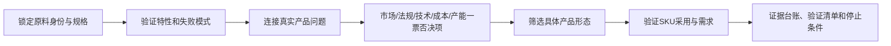

> 中文版项目说明（English version: [README.md](../README.md)）。本文档是作品集的完整中文叙述；英文 README 提供速览、安装与用法。

# Ingredient Opportunity Research

> 一个面向化工企业战略发展与原料业务团队的证据型研究 Skill：在新原料工艺开发和重资产投入前，识别真实机会、一票否决项与下一步验证动作。

## 30 秒看懂这个产品

| 产品问题 | 我的回答 |
|---|---|
| 首要用户 | 化工企业战略发展部；未设完整战略部门时，也包括企业主、业务负责人和兼职市场研究人员 |
| 他们要做什么决定 | 新原料是否值得工艺开发、产能建设、应用验证或市场进入 |
| 原有流程哪里失效 | 跨专业人工搜索耗时且容易遗漏；市场报告、论文、专利、标签和供应商材料口径混杂 |
| 核心方案 | 建立 `原料身份 → 特性 → 产品问题 → 一票否决项 → 产品形态 → 市场采用 → 内部经济性 → 决策行动` 的可审计链路 |
| 产品原则 | 先阻止错误决策，再追求完整报告；未知不自动变成中性结论 |
| 协作角色 | 工艺研发、应用研发、销售、法规、财务与行业专家——系统提供共享证据链与未决项，最终签字与领域判断保留给人类 |
| 当前验证状态 | v1.2 初步开发完成，进入跨原料持续验证阶段；一句话重复盲评、结构化校准与 DeepSeek 跨模型复现均已完成（跨模型结果为中性-混合，如实保留），已有专家试用正向反馈，仍需人类专家与真实案例验证 |

## 我从案例审计中识别的问题假设

原料机会研究最危险的结果不是“信息不够多”，而是把不同层级的证据拼成一个看似确定的商业结论。例如：

- 把同名原料、不同纯度、菌株、来源或牌号当成同一个产品；
- 把论文里的机制、专利示例或法规允许，写成成品人体功效；
- 把产能、推荐摄入缺口、低渗透率或询盘直接写成市场缺口；
- 把品牌属于某个品类，写成它正在使用或准备采购该原料；
- 用零售挂牌价、不同规格报价推断成交价格和下降趋势。

这些模式在仓库案例审计中反复出现，可能让团队在工艺研发或产线建设前形成错误判断。因此我把首要产品问题定义为**高额投入前的决策质量**，而不是生成更长的行业报告。市场容量过小、法规周期过长、实际生产成本高于成交价等单一信息具有一票否决权，不能被其他优势平均掉。

## 我的产品判断

我没有把它设计成“自动找热门应用”的提示词，而是做成一个带硬门槛的决策工作流：



三项关键取舍：

1. **不用一个“机会分数”掩盖不同风险。** 法规、技术、需求和证据状态分别表达。
2. **报告可以不完整，但不能假装完整。** 无法对齐的数据输出 `not reliably estimable`，并给出最小补证动作。
3. **产品形态先于市场规模和客户名单。** “舒缓护肤”“烘焙”“饮料”不是可销售形态，必须落到基质、工艺、包装、用量、宣称和买家。

完整的产品需求见 [产品需求文档（PRD）](PRD.md)；问题形成过程、决策链和设计取舍见 [产品案例说明](product-case-study.md)。

### 我的职责与 AI 协作边界

- 我负责定义决策问题、证据边界、工作流架构、案例审计方法、测试设计和保留/修复规则；
- AI 用于公开资料研究、初稿生成、受控测试和独立审查；
- 已有专家试用，但当前没有行业专家参与仓库内的正式盲评，也没有证据证明真实销售、立项或投资回报改善；
- 用户反馈估计节省约 80%–90% 搜索时间并提高判断准确性；由于仓库尚无样本量、计时基线和逐项评审记录，当前按初步试用结果呈现，不作为独立量化结论。

## 我如何验证它是否好用

我把“好用”拆成四层，避免用一个验证脚本冒充产品效果：

| 层级 | 验证问题 | 当前证据 | 能证明什么 | 不能证明什么 |
|---|---|---|---|---|
| 结构验证 | Skill 是否完整、链接是否有效、案例是否包含必要章节 | `python3 scripts/validate_project.py` | 文件和输出契约可执行 | 事实正确或商业有效 |
| 案例审计 | 工作流能否暴露身份、法规、技术、采用和价格缺口 | Isomalt 82、Gellan gum 72、HMO 68；内部研究质量自审 | 输出质量和缺口可见 | 事实准确、机会优劣、外部专家评分或 Skill 因果提升 |
| 一句话重复对照 | 用户不懂完整框架时，Skill 是否稳定补全决策维度 | [三案例、每组各 3 次重复盲评](../evaluation/minimal-prompt-benchmark/README.md) | 合成案例中 Skill 95.0 vs Direct 85.7，且组内波动更小 | 行业认可、真实市场准确率、跨模型泛化或业务结果 |
| 三案例受控对照 | 相同证据包下，Skill 是否提高审计完整性和行动可执行性 | [Direct vs Skill 三案例评测](../evaluation/three-case-comparison/README.md) | 三个合成资本决策场景中 Direct 283/300、Skill 298/300 | 真实事实准确性、专家效率、商业结果或跨模型泛化 |
| 专家试用 | 系统是否节省搜索时间并提高专业覆盖 | 用户报告有效、覆盖较全面、未发现明显错误，估计节省 80%–90% 时间 | 已进入可用和持续验证阶段 | 缺少样本量、计时基线和独立准确性评分，不能视为正式量化验证 |

详细量表、硬门槛和案例剩余缺口见 [案例质量审计](../evaluation/case-audit.md)。

### 主评测：一句话输入的完整性与稳定性

用户只需说一句“请评估这个原料是否值得建设目标产线，并给出依据和下一步”。在三个预注册合成案例、每种条件三次独立会话中：

| 条件 | 9 份输出均分 | 最低分 | 总体极差 | 总体标准差 | 硬失败 |
|---|---:|---:|---:|---:|---:|
| Direct | 85.7 | 60 | 40 | 11.4 | 0 |
| Skill | 95.0 | 87 | 13 | 4.7 | 0 |

Skill 在三个案例中的均分都更高，且每个案例的组内极差和标准差都更小。差异最明显地出现在 DermaBis-A95 的 SKU 采用、市场容量处置和产品形态框架。两组 18 份输出的 headline decision 都是“不立即建线、先做有边界验证”，所以结论是**框架覆盖和重复运行稳定性改善**，不是“只有 Skill 才能得出正确结论”。盲评由同模型族而非行业专家完成；分组映射也未在评分前做哈希承诺，只能视为作者记录，不能写成“化工行业认可”或完全独立可审计的因果实验。

### 校准评测：结构化提示下的三个预注册案例

| 案例 | Direct | Skill | 差值 | 两组硬失败 |
|---|---:|---:|---:|---:|
| FermaDHA-X 扩产 | 96 | 100 | +4 | 0 |
| MycoPro-PV9 宠物食品扩线 | 92 | 99 | +7 | 0 |
| DermaBis-A95 护肤原料专线 | 95 | 99 | +4 | 0 |
| **平均分** | **94.3** | **99.3** | **+5.0** | **0** |

Direct 组已经能做出安全的 headline decision；Skill 的优势主要体现在资本决策审计覆盖、不可比证据处理和下一步验证门槛，而不是把错误结论变成正确结论。协议、冻结输入、匿名原始输出、盲评分、组别揭盲和 CSV 数据均保存在仓库中；但组别映射没有在评分前做哈希承诺，只能按作者记录解释。三个案例是针对已知失败模式设计的合成回归测试，不是无偏市场 benchmark。

### 跨模型复现：DeepSeek（如实保留的中性-混合结果）

为检验优势是否跨模型成立，用 DeepSeek（`deepseek-v4-flash`）复刻了同一套冻结基准（同一事实包、同一句话提示、同一轮转顺序、同一冻结 rubric；6 个全新会话、匿名输出、独立盲评会话打分，评审者从未见过条件标签）：[deepseek 运行](../evaluation/minimal-prompt-benchmark/deepseek/README.md)。

| 条件 | 整体均分 | 最低分 | 总体极差 | 总体标准差 | 硬失败 |
|---|---:|---:|---:|---:|---:|
| Direct | 96.6 | 92 | 8 | 3.9 | 0 |
| Skill | 96.8 | 87 | 13 | 4.8 | 0 |

**结果：Skill 的整体优势未在 DeepSeek 上复现**——均分几乎打平（96.8 vs 96.6），Direct 反而更稳定（极差 8 vs 13）；逐案例：FermaDHA-X 打平（100/100），MycoPro-PV9 Skill 领先（94.7 vs 92.0，唯一完整处理"名目产能 vs 合格可售产出"的是 Skill 输出），DermaBis-A95 Direct 领先（97.7 vs 95.7）。18/18 均为安全 headline（0 建线），0 硬失败。按原协议预注册门禁，其中 2 项（Skill 均分更高、Direct 更不稳定）未达成。

含义：**技能收益依赖模型**——在直接生成最弱处增益最大，直接生成已很强时增益趋近于零。该中性-混合结果刻意保留，收窄了可主张的结论：特定决策维度上的框架覆盖增益，而非普适优势。

### 北极星指标与下一轮验证门槛（预注册）

北极星：**专家认可的决策关键 blocker 召回率**——系统识别出的法规、技术、身份、市场与采用 blocker 占专家共识清单的比例。重资产决策中漏掉一个有否决权的信息，损失可能大于节省的全部搜索时间，因此效率指标必须建立在 blocker 召回与事实准确不下降的前提下。

| 指标 | 预注册门槛 |
|---|---:|
| Skill 独有关键硬门槛漏检 | 0（5 个冻结真实案例，与无 Skill 基线比较） |
| 严重无证据强结论 | 0（3 名盲评者，预注册 rubric） |
| 决策 blocker 召回率 | ≥90%（对照行业专家共识清单） |
| 下一步可执行性 | ≥4/5 案例（含对象、动作、证据门槛和停止条件） |
| 搜索与研究时间 | 在 ≥3 个真实案例中复现中位数降低 ≥80% |
| 专家实质修改量 | 中位数降低 ≥15% |
| 市场现实匹配度 | 不低于专家基线（事后用真实价格、产能、客户与法规复核） |
| 建议准确性 | 严重错误为 0 |

以上门槛目前一项都未达成——它们是验证计划。专家试用反馈（估计节省 80%–90% 时间）为用户报告口径，尚无样本量、计时基线与逐项评审记录，本仓库不将其表述为独立量化验证。

## 我如何发现问题并修复

每次修改都保留 `问题信号 → 假设 → 最小修改 → 检查 → 保留/回退`。前四轮主要是规则设计与案例回归检查；只有第 5、6 轮有同输入对照，不把规则符合性检查冒充因果验证。

| 问题信号 | 根因判断 | 产品修改 | 如何验证 |
|---|---|---|---|
| 应用停留在“舒缓护肤”等大类 | 类目规模不能直接指导配方或客户 | 新增产品形态筛选：基质、工艺、包装、接触方式、用量、宣称、替代品和买家 | Bisabolol 案例必须逐形态给出结果和决定性缺口 |
| 供应商称全球需求 500–800 吨 | 单一利益相关方数字被当成市场事实 | 新增供给、贸易、下游使用三视角和来源独立性检查 | 无独立闭环时必须输出不可可靠估计 |
| 低渗透率、营养缺口、RFQ 被写成供需缺口 | 需求成熟度与供应约束被合并 | 新增 demand maturity、supply constraint、evidence status 三轴 | 对抗用例禁止把非约束询盘写成 committed demand |
| 不同来源、规格和条款价格被拿来算降价 | 比较对象不一致 | 增加同口径价格趋势门槛 | 不匹配快照只能支持价格离散，不能计算降幅 |

完整迭代证据见 [迭代记录](../evaluation/iteration-log.md)。这里明确区分：**结构和表达改善不会自动提高证据分数。**

## 案例

| 案例 | 被验证的产品问题 | 当前状态 |
|---|---|---|
| [Isomalt：中国烘焙](../examples/01-isomalt-china-bakery.md) | 身份混淆、耐受风险、使用成本、10 个探索账户 | 内部质量自审 82/100；非机会分/外部评分，仍缺完整标签和美国法律路径 |
| [Gellan gum：消费品](../examples/02-gellan-gum-consumer-products.md) | HA/LA 牌号、饮料法规、替代体系和客户优先级 | 内部质量自审 72/100；非机会分/外部评分，仍缺当前标签和同口径体系成本 |
| [HMO：全球市场](../examples/03-hmo-global-market.md) | 分子家族、菌株/来源授权、消费者教育和客户路由 | 内部质量自审 68/100；非机会分/外部评分，仍缺完整美欧矩阵和工业 RFQ |
| [Bisabolol：中国护肤](../examples/04-bisabolol-china-skincare.md) | 产品形态、市场需求审计、促渗风险和采用证据 | 预审，尚未 decision-ready，不评分 |

低分或未评分不是失败隐藏，而是产品输出的一部分：它告诉使用者哪里不能继续推断，以及下一步应该购买、询问或实验什么。

## 路线图

- **v1.0（已完成）**：研究契约、特性到市场链路与硬门槛、产品形态筛选、证据台账、验证清单、Markdown 报告与可选客户行动。
- **v1.x（当前）**：跨原料持续验证——用不同原料比较系统判断与实际价格、产能、法规和客户情况；建立 5 个以上冻结真实案例与专家 gold set；多评审盲评、完成时间与修改量记录；按失败类型做最小规则修复。
- **v2（可组合战略分析工具）**：保持 Skill 形态，提供结构化输入输出契约、企业数据接口与版本化证据对象；与其他财务、技术、竞争和项目决策 Skill 组合，而不重复建设其能力。
- **v3（仅当需求确认）**：机会判断写作工作台——结构化 intake、证据台账/清单/报告版本比较、专家批注、决策日志、刷新提醒、权限与审计。

平台化本身不是目标；除非确认存在长期协作、权限与数据集成需求，Skill 作为更轻量的产品形态保持不变。

## Repository structure

```text
.
├── skill/ingredient-opportunity-research/  # 可安装 Skill 与按需加载的 references
├── .agents/skills/ingredient-opportunity-research/  # 零安装发现副本（Codex/Kimi/DSH）
├── install.sh                               # 一键安装脚本（--codex/--claude/--project/--kimi/--dsh/--all）
├── docs/PRD.md                              # 用户、需求、AI 机制、指标与验收标准
├── docs/product-case-study.md               # 产品问题、用户、需求与设计取舍
├── examples/                                # 五个证据边界不同的案例（00–04）
├── evaluation/
│   ├── case-audit.md                        # 硬门槛与质量审计
│   ├── iteration-log.md                     # 问题—修复—验证记录
│   ├── controlled-test/                     # 首个冻结扩产测试
│   ├── three-case-comparison/               # 结构化提示校准：协议、盲评和 CSV
│   └── minimal-prompt-benchmark/            # 一句话、3 次重复、匿名输出、稳定性数据 + deepseek/ 跨模型复现
├── scripts/validate_project.py              # 无第三方依赖的结构校验
└── .github/workflows/validate.yml           # GitHub Actions
```

## Install and invoke

**在仓库内使用 Codex / Kimi Code / DeepSeek Harness：克隆即用**——仓库随包提供 `.agents/skills/ingredient-opportunity-research/` 发现副本，克隆后打开即自动发现，无需安装。**要在其他项目使用**：运行 `./install.sh --codex`（或其他平台参数）即可；也可手动 `cp -R skill/ingredient-opportunity-research <目标路径>`。各平台安装位置与调用语法见 [英文 README 的 Install 表](../README.md#install)。

```text
使用 ingredient-opportunity-research，调研[原料]在[国家/产品领域]的市场机会。
先输出可行性报告，再根据已验证证据识别[N]个潜在客户。
```

更多可复现请求见 [example prompts](../prompts/example-prompts.md)。

### 你问什么就得到什么——以及哪些是可选的

| 交付物 | 触发方式 | 角色 |
|---|---|---|
| 完整可行性报告 | 只给原料名，或一般提问（"调研 X 的市场机会"） | **默认**——每次一般或最小输入都会产出 |
| 潜在客户清单（N 家） | "为 X 找 N 家潜在客户" | **可选**——仅当单独提出 |
| KA 攻坚卡 | "X 的 KA 攻坚卡"/"先攻哪个客户" | **可选**——仅当单独提出，须基于报告证据 |
| 访谈提纲 / 演示大纲 | 点名要某类物料 | **可选**——仅当单独提出，须基于报告证据 |

规则：

- 只给原料名（如"HMO"）默认产出完整的市场机会分析；缺失的信息成为标注的假设，报告结尾会说明提供什么输入可收窄分析。
- 一般请求**只**产出报告——客户清单、KA 卡和销售物料绝不自动附带。
- 单独点单**只**产出那一块，基于已有报告的证据，不重跑市场研究。
- 还没有报告？技能会说明"该物料无证据底座无法支撑"，先产出可行性分析——不会凭空编造有依据的交付物。
- 报告内部某些模块也是可选的：市场规模审计、供需缺口审计、市场认知/教育等章节，仅在影响决策时才出现。

## Boundaries

- 公开资料不能证明保密配方、供应关系、合同价格或采购意图；
- 原料合法可用不等于成品宣称已经成立；
- 标签只能证明出现，不能证明添加量、因果功效或商业效果；
- 专利和供应商应用资料是实验起点，不是生产配方；
- 所有法规、价格、SKU 和公司信息在商业使用前必须刷新；
- 本项目支持专家决策，不替代法规、配方、采购或商业负责人；
- 不是监测平台：不做实时监控、数据库持续更新或 CRM 写入；
- 不自动购买付费数据、绕过访问控制或使用未授权内部资料；
- 不把未经脱敏和授权的内部工艺、成本、报价或产能数据发送给外部模型。
